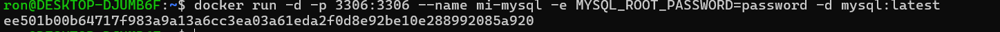
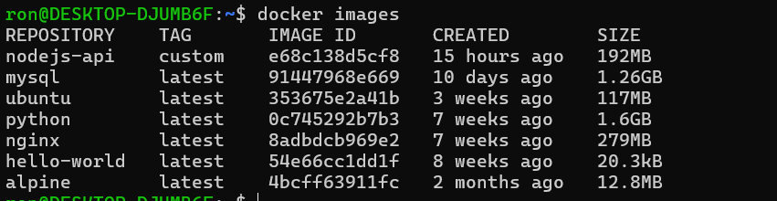
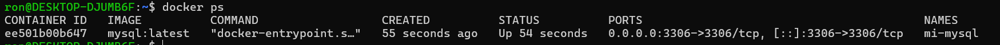
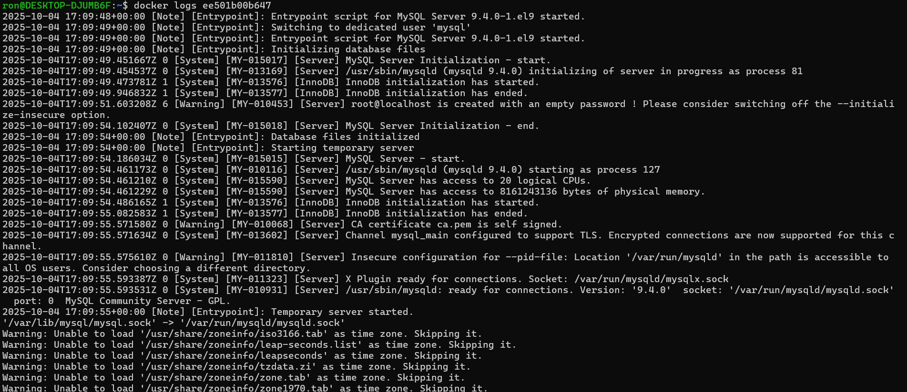
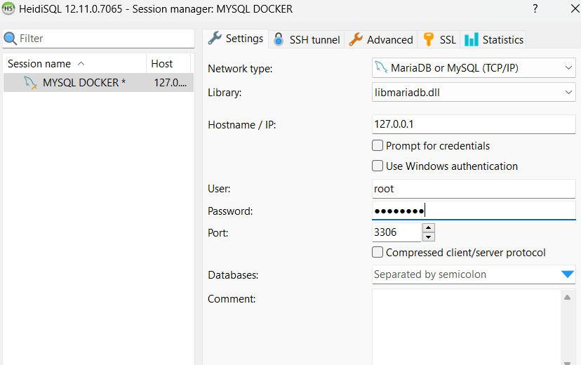
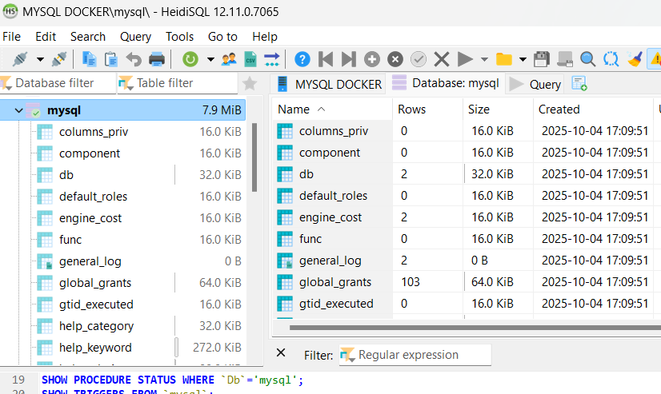
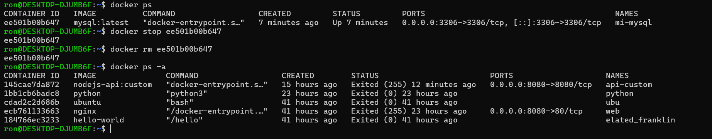
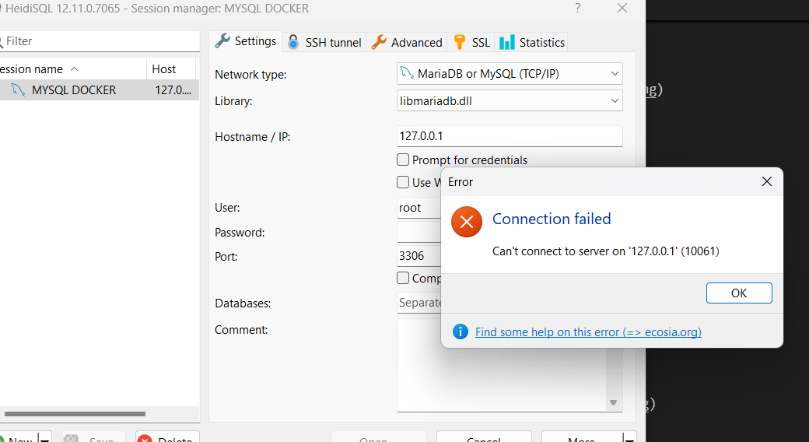

# Tareas - Curso Docker & Kubernetes

## MYSQL
---
1. Command 
```bash
 docker run -d -p 3306:3306 --name mi-mysql -e MYSQL_ROOT_PASSWORD=password -d mysql:latest
```
---
-p mapear el purto
-e  variables de entorno , especificado en la documentancion de la imagem
-name  nombre del contenedeor a crearse
-d ejecitar por debajo

3. docker ps -a
```bash
docker ps -a
```

4. docker images
```bash
docker images
```

5. docker ps
```bash
docker ps
```

6. docker logs
```bash
docker logs <container_id>
```

7. client connection

8.  mysql connected

9. remove the container
```bash
docker ps
docker stop ee501b00b647
docker rm ee501b00b647
docker ps -a
```


9. verify it is stoped


## Conslusiones
 COnsulta siempre la docuemntacion de la imagen para revisar las configuraciones variables de entorno  puertos exposuestos.