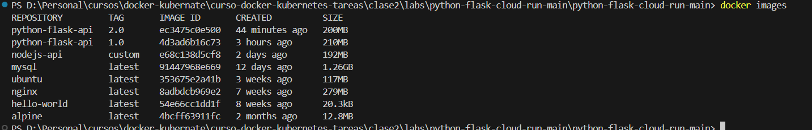

# dokcer files

## Python flask App

1. Review the base image:


1. Comand to create a image 

```bash
 docker build -t python-flask-api:1.0 .
```
-- output of the creation

 
2. Docker file

[Dockerfile](./labs/python-flask-cloud-run-main/python-flask-cloud-run-main/Dockerfile)

3. history and inspect

docker history python-flask-api:1.0
```bash
 docker history python-flask-api:1.0
 docker inspect python-flask-api:1.0

```

3. Comand to deploy the image

```bash
 docker run -p 8000:8080 --name my_flask_app python-flask-api:1.0
```


4. docker ignore 
[.dockerignore](./labs/python-flask-cloud-run-main/python-flask-cloud-run-main/.dockerignore)


5. Command to get into the container

```bash
 docker run -it -p 8000:8080 --name my_flask_app python-flask-api:1.0 bash
```

6.  endpoints


7. verify logs

```bash
  docker logs dd8176b10013
```


8. size of the images v2 latest



9. docker login


10. 

```bash
  docker tag python-flask-api:1.0  docker-practices
  docker push ronaldchoque/docker-practices
```


-- web


10. notes

-  Revisar el manejo de seguridad.  me genero errores
- no pude desplegar con unicord